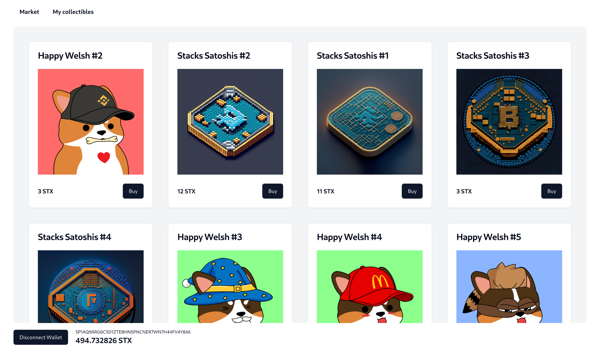

<br />
<div align="center">
  <h3 align="center">Marxet</h3>

  <p align="center">
    NFT marketplace on the stacks ecosystem
    <br />
    <a href="https://marxet.floriangaspard.com">View online</a>
  </p>
</div>



# About

Front-end and smart-contracts for a NFT marketplace on the stacks blockchain

Contracts are deployed on testnet only.

Built with React + TypeScript + Vite + Clarity + shadcn-ui.

# Installation

```
npm install
```

# Getting started

## Start development server

```
  npm run dev
```

## Build and run

1. Build

```
  npm run build
```

# Contact

floriangaspard.fg@gmail.com
